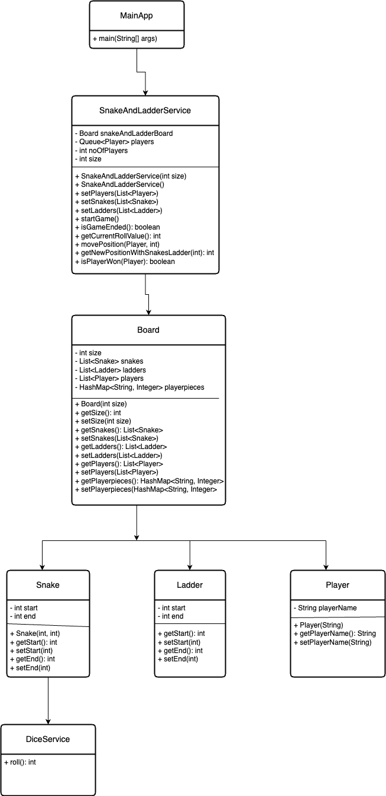

# [Design Snake and Ladder]

## Problem Statement
Create a snake and ladder application. The application should take as input (from the command line or a file):
- Number of snakes (s) followed by s lines each containing 2 numbers denoting the head and tail positions of the snake.
- Number of ladders (l) followed by l lines each containing 2 numbers denoting the start and end positions of the ladder.
- Number of players (p) followed by p lines each containing a name.

After taking these inputs, you should print all the moves in the form of the current player name followed by a random number between 1 to 6 denoting the die roll and the initial and final position based on the move.
<br>
Format: ```<player_name> rolled a <dice_value> and moved from <initial_position> to <final_position>```

When someone wins the game, print that the player won the game.
<br>
Format: ```<player_name> wins the game```

## Rules of the game
- The board will have 100 cells numbered from 1 to 100.
- The game will have a six sided dice numbered from 1 to 6 and will always give a random number on rolling it.
- Each player has a piece which is initially kept outside the board (i.e., at position 0).
- Each player rolls the dice when their turn comes.
- Based on the dice value, the player moves their piece forward that number of cells. Ex: If the dice value is 5 and the piece is at position 21, the player will put their piece at position 26 now (21+5).
- A player wins if it exactly reaches the position 100 and the game ends there.
- After the dice roll, if a piece is supposed to move outside position 100, it does not move.
- The board also contains some snakes and ladders.
- Each snake will have its head at some number and its tail at a smaller number.
- Whenever a piece ends up at a position with the head of the snake, the piece should go down to the position of the tail of that snake. 
- Each ladder will have its start position at some number and end position at a larger number.
- Whenever a piece ends up at a position with the start of the ladder, the piece should go up to the position of the end of that ladder.
- There could be another snake/ladder at the tail of the snake or the end position of the ladder and the piece should go up/down accordingly.

## Assumptions you can take apart from those already mentioned in rules
- There won’t be a snake at 100.
- There won’t be multiple snakes/ladders at the same start/head point.
- It is possible to reach 100, i.e., it is possible to win the game.
- Snakes and Ladders do not form an infinite loop.

## Sample Input
```
Enter number of snakes -> 
3
Enter the head position of snake 1 -> 
16
Enter the tail position of snake 1 -> 
6
Enter the head position of snake 2 -> 
47
Enter the tail position of snake 2 -> 
26
Enter the head position of snake 3 -> 
49
Enter the tail position of snake 3 -> 
11
Enter number of ladders -> 
3
Enter the bottom position of ladder 1 -> 
16
Enter the top position of ladder 1 -> 
6
Enter the bottom position of ladder 2 -> 
47
Enter the top position of ladder 2 -> 
26
Enter the bottom position of ladder 3 -> 
49
Enter the top position of ladder 3 -> 
11
Enter number of players -> 
2
Enter name of player 1 -> 
Harkirat
Enter name of player 2 -> 
Lamba
```

## Sample Output
```
Game is starting -------> 
Player Harkirat moved from position 0 to 4
Player Lamba moved from position 0 to 2
Player Harkirat moved from position 4 to 6
Player Lamba moved from position 2 to 7
Player Harkirat moved from position 6 to 12
Player Lamba moved from position 7 to 9
Player Harkirat moved from position 12 to 14
Player Lamba moved from position 9 to 13
Player Harkirat moved from position 14 to 19
Player Lamba moved from position 13 to 15
Player Harkirat moved from position 19 to 22
Player Lamba moved from position 15 to 18
Player Harkirat moved from position 22 to 27
Player Lamba moved from position 18 to 24
Player Harkirat moved from position 27 to 29
Player Lamba moved from position 24 to 30
Player Harkirat moved from position 29 to 33
Player Lamba moved from position 30 to 35
Player Harkirat moved from position 33 to 35
Player Lamba moved from position 35 to 38
Player Harkirat moved from position 35 to 41
Player Lamba moved from position 38 to 41
Player Harkirat moved from position 41 to 43
Player Lamba moved from position 41 to 42
Player Harkirat moved from position 43 to 48
Player Lamba moved from position 42 to 46
Player Harkirat moved from position 48 to 51
Player Lamba moved from position 46 to 50
Player Harkirat moved from position 51 to 55
Player Lamba moved from position 50 to 56
Player Harkirat moved from position 55 to 61
Player Lamba moved from position 56 to 62
Player Harkirat moved from position 61 to 63
Player Lamba moved from position 62 to 65
Player Harkirat moved from position 63 to 66
Player Lamba moved from position 65 to 66
Player Harkirat moved from position 66 to 68
Player Lamba moved from position 66 to 69
Player Harkirat moved from position 68 to 69
Player Lamba moved from position 69 to 70
Player Harkirat moved from position 69 to 70
Player Lamba moved from position 70 to 72
Player Harkirat moved from position 70 to 74
Player Lamba moved from position 72 to 76
Player Harkirat moved from position 74 to 79
Player Lamba moved from position 76 to 80
Player Harkirat moved from position 79 to 85
Player Lamba moved from position 80 to 84
Player Harkirat moved from position 85 to 87
Player Lamba moved from position 84 to 89
Player Harkirat moved from position 87 to 91
Player Lamba moved from position 89 to 94
Player Harkirat moved from position 91 to 94
Player Lamba moved from position 94 to 98
Player Harkirat moved from position 94 to 96
Player Lamba moved from position 98 to 98
Player Harkirat moved from position 96 to 96
Player Lamba moved from position 98 to 100
Player Lamba won the game!!
```

